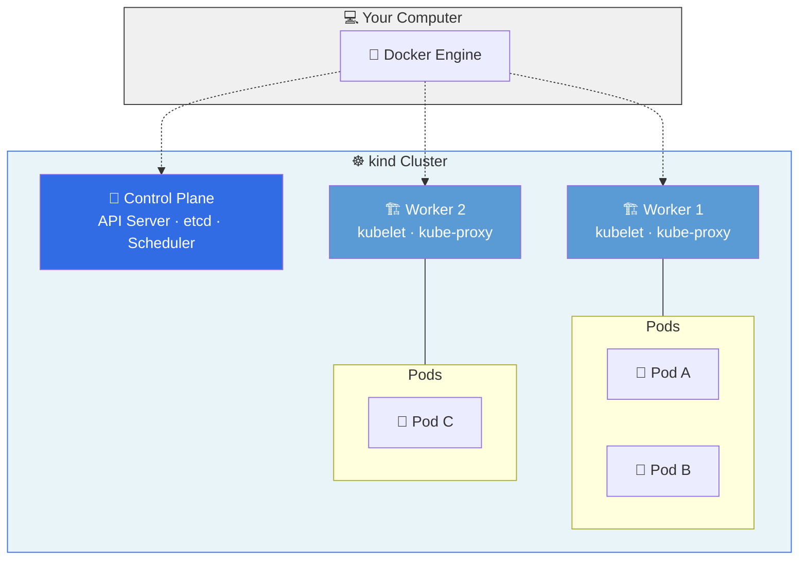
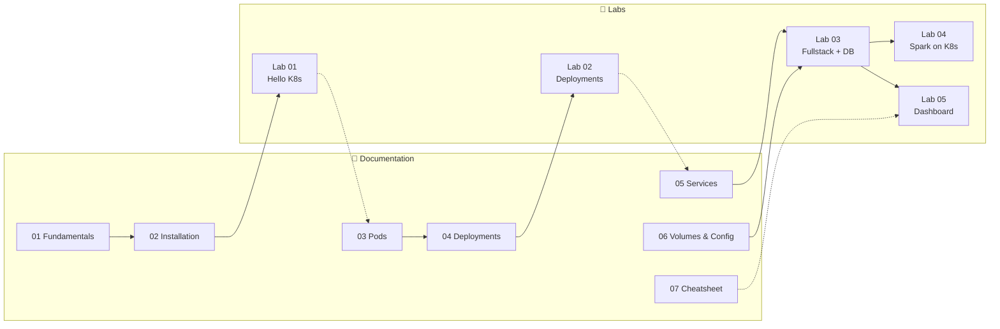

# ☸️ Kubernetes Lab

### **Complete and practical Kubernetes (K8s) tutorial**
From Docker to Kubernetes — orchestrate containers like a pro, with examples you run on your own machine.


---

## 🎯 What is this repository?

A **hands-on lab** to learn Kubernetes in practice — the natural continuation of the [Docker Lab](https://github.com/lemaufpb/cdn-docker-lab). Each concept is taught with:

- 📖 **Rich documentation** — detailed explanations with diagrams and analogies
- 🧪 **Practical labs** — step-by-step exercises you run in the terminal
- 📄 **Real YAML manifests** — configuration files ready to apply on the cluster
- 💻 **Working code** — Python applications that run in K8s Pods

> **Target audience:** Students who have completed the Docker Lab (or equivalent Docker knowledge). No prior Kubernetes experience required.

> **Tool used:** We use **[kind](https://kind.sigs.k8s.io/)** (Kubernetes IN Docker) to run local K8s clusters. kind creates cluster nodes as Docker containers — lightweight, fast, and without VMs.



---

## ⚡ Quick Start (5 minutes)

If you already have Docker installed, you can create your first K8s cluster now:

```bash
# 1. Install kind and kubectl
# macOS:
brew install kind kubectl

# Linux:
curl -Lo ./kind https://kind.sigs.k8s.io/dl/latest/kind-linux-amd64
chmod +x ./kind && sudo mv ./kind /usr/local/bin/kind
# kubectl: https://kubernetes.io/docs/tasks/tools/install-kubectl-linux/

# 2. Clone the repository
git clone https://github.com/lemaufpb/cdn-k8s-lab.git
cd cdn-k8s-lab

# 3. Create a local Kubernetes cluster
kind create cluster --name my-first-cluster

# 4. Verify the cluster is running
kubectl get nodes
# → NAME                            STATUS   ROLES           AGE   VERSION
# → my-first-cluster-control-plane  Ready    control-plane   30s   v1.31.0

# 5. Run your first Pod (Nginx)
kubectl run hello-nginx --image=nginx:latest --port=80

# 6. Verify the Pod
kubectl get pods
# → NAME          READY   STATUS    RESTARTS   AGE
# → hello-nginx   1/1     Running   0          10s

# 7. Access in the browser via port-forward
kubectl port-forward pod/hello-nginx 8080:80
# Open: http://localhost:8080 — Welcome to nginx! 🎉

# 8. Cleanup
# Ctrl+C to stop port-forward
kubectl delete pod hello-nginx
kind delete cluster --name my-first-cluster
```

**Congratulations!** 🎉 You have just created a Kubernetes cluster and ran an application on it.

---

## ⚙️ Prerequisites

| Requirement | Details |
|---|---|
| **Docker** | [Install Docker Desktop](https://docs.docker.com/get-docker/) (Windows/macOS) or Docker Engine (Linux) |
| **Docker Lab** | [Complete the cdn-docker-lab](https://github.com/lemaufpb/cdn-docker-lab) (or equivalent knowledge) |
| **Terminal** | PowerShell (Windows), Terminal.app (macOS) or bash (Linux) |
| **RAM** | 8 GB free (16 GB recommended for Labs 04-05) |
| **CPU** | 4 cores minimum |
| **Disk** | 10 GB free for Docker images and cluster nodes |

---

## 🔧 Dependency Installation

### macOS

```bash
# Install kind (Kubernetes IN Docker)
brew install kind

# Install kubectl (Kubernetes CLI)
brew install kubectl

# (Optional) Install k9s — terminal UI for K8s
brew install k9s

# Verify everything is installed
kind version && kubectl version --client
```

### Linux (Ubuntu/Debian)

```bash
# Install kind
curl -Lo ./kind https://kind.sigs.k8s.io/dl/latest/kind-linux-amd64
chmod +x ./kind
sudo mv ./kind /usr/local/bin/kind

# Install kubectl
curl -LO "https://dl.k8s.io/release/$(curl -L -s https://dl.k8s.io/release/stable.txt)/bin/linux/amd64/kubectl"
chmod +x kubectl
sudo mv kubectl /usr/local/bin/kubectl

# (Optional) Install k9s
curl -sS https://webi.sh/k9s | sh

# Verify
kind version && kubectl version --client
```

### Windows (PowerShell)

```powershell
# Install kind (via Chocolatey)
choco install kind

# Install kubectl
choco install kubernetes-cli

# (Optional) Install k9s
choco install k9s

# Verify
kind version; kubectl version --client
```

> **Important:** Docker Desktop must be running with **WSL 2** enabled on Windows. On Linux, ensure the Docker Engine service is active (`sudo systemctl start docker`).

Verify the installation:
```bash
docker version          # Docker Engine (must show Client + Server)
kind version            # kind (Kubernetes IN Docker)
kubectl version --client  # kubectl (Kubernetes CLI)
```

---

## 🗺️ Learning Map

The content is organized into **conceptual documentation** + **practical labs**, following a didactic progression:

### 📖 Documentation

| # | Module | Topics | Link |
|---|---|---|---|
| 01 | **K8s Fundamentals** | Why orchestrate, architecture, Control Plane, Workers, declarative philosophy | [📖 Read](docs/01-fundamentos-k8s.md) |
| 02 | **Installation (kind)** | Installing kind, kubectl, k9s, creating clusters, kind-config | [📖 Read](docs/02-instalacao-kind.md) |
| 03 | **Pods and Containers** | YAML anatomy, lifecycle, Labels, Selectors, resource limits | [📖 Read](docs/03-pods-e-containers.md) |
| 04 | **Deployments** | ReplicaSets, rolling updates, rollback, scaling, HPA | [📖 Read](docs/04-deployments-e-replicasets.md) |
| 05 | **Services and Networking** | ClusterIP, NodePort, LoadBalancer, internal DNS, Ingress | [📖 Read](docs/05-services-e-networking.md) |
| 06 | **Volumes and Config** | PV, PVC, ConfigMaps, Secrets, StorageClass | [📖 Read](docs/06-volumes-e-configmaps.md) |
| 07 | **kubectl Cheatsheet** | Quick reference for all essential commands | [📖 Read](docs/07-kubectl-cheatsheet.md) |

### 🧪 Practical Labs

| # | Lab | Approach | What it does | Time | Link |
|---|---|---|---|---|---|
| 01 | **Hello K8s** | First cluster | kind, kubectl, Pods, port-forward | 30 min | [🧪 Go](labs/lab-01-hello-k8s/README.md) |
| 02 | **Deployments** | Scaling and rollouts | Replicas, rolling update, rollback, Services | 30 min | [🧪 Go](labs/lab-02-deployments/README.md) |
| 03 | **Fullstack App** | K8s + External DB | API on K8s + External PostgreSQL (Docker) + pgAdmin | 40 min | [🧪 Go](labs/lab-03-app-fullstack/README.md) |
| 04 | **Spark on K8s** | Big Data on the cluster | Spark Master + Workers, WordCount job, scalability | 35 min | [🧪 Go](labs/lab-04-spark-on-k8s/README.md) |
| 05 | **Dashboard** | Visual monitoring | Kubernetes Dashboard, k9s, cluster metrics | 25 min | [🧪 Go](labs/lab-05-dashboard-e-monitoring/README.md) |

### 📍 Suggested Progression



---

## 📂 Repository Structure

```mermaid
graph TB
    ROOT["cdn-k8s-lab/"] --> DOCS["📖 docs/<br/>Conceptual documentation"]
    ROOT --> LABS["🧪 labs/<br/>Practical exercises"]
    ROOT --> CFG["kind-config.yaml"]
    ROOT --> GI[".gitignore"]
    ROOT --> README["README.md"]

    DOCS --> D01["01-fundamentos-k8s.md<br/>What is K8s, architecture"]
    DOCS --> D02["02-instalacao-kind.md<br/>Installing kind and tools"]
    DOCS --> D03["03-pods-e-containers.md<br/>Pods, Labels, lifecycle"]
    DOCS --> D04["04-deployments-e-replicasets.md<br/>Deployments, scaling"]
    DOCS --> D05["05-services-e-networking.md<br/>Services, DNS, Ingress"]
    DOCS --> D06["06-volumes-e-configmaps.md<br/>PV/PVC, ConfigMaps, Secrets"]
    DOCS --> D07["07-kubectl-cheatsheet.md<br/>Quick command reference"]

    LABS --> L01["lab-01-hello-k8s/<br/>First cluster + Pod"]
    LABS --> L02["lab-02-deployments/<br/>Deployments, scaling"]
    LABS --> L03["lab-03-app-fullstack/<br/>K8s + External DB"]
    LABS --> L04["lab-04-spark-on-k8s/<br/>Spark on K8s"]
    LABS --> L05["lab-05-dashboard-e-monitoring/<br/>Dashboard & k9s"]

    L02 --> L02M["manifests/"]
    L03 --> L03A["app/"]
    L03 --> L03M["manifests/"]
    L04 --> L04M["manifests/"]
    L04 --> L04J["jobs/"]
    L05 --> L05M["manifests/"]

    style ROOT fill:#326CE5,color:#fff
    style DOCS fill:#fff,stroke:#326CE5
    style LABS fill:#fff,stroke:#326CE5
```



---

## 🔑 Key Concepts

| Concept | Description |
| :--- | :--- |
| **☸️ Cluster** | Set of machines (nodes) that run containerized applications managed by Kubernetes. Composed of Control Plane + Worker Nodes. |
| **🧠 Control Plane** | Brain of the cluster. Contains API Server, Scheduler, Controller Manager, and etcd. Makes all decisions about where and how to run Pods. |
| **🏗️ Worker Node** | Machine that runs workloads. Contains kubelet (agent), kube-proxy (network), and the container runtime (containerd). |
| **🫛 Pod** | Smallest executable unit in K8s. Encapsulates one or more containers that share network and storage. Ephemeral — can be destroyed and recreated at any time. |
| **🚀 Deployment** | Manages Pods declaratively. Defines how many replicas to maintain, update strategy, and allows automatic rollback. |
| **🌐 Service** | Stable virtual address that routes traffic to a set of Pods. Solves the problem of ephemeral Pods with changing IPs. |
| **💾 PersistentVolumeClaim** | Request for persistent storage. Guarantees that data survives Pod destruction and recreation. |
| **🗝️ Secret** | Stores sensitive data (passwords, tokens, certificates) in encrypted form, separated from application code. |
| **📋 ConfigMap** | Stores non-sensitive configuration (URLs, flags, .conf files) externalized from containers. |
| **📝 Declarative YAML** | In K8s, you describe the **desired state** in YAML. K8s continuously works to keep the cluster in that state. |

---

## 📝 Quick Cheatsheet

```bash
# ── Cluster (kind) ──
kind create cluster --name lab                    # Create cluster
kind create cluster --config kind-config.yaml     # Create with configuration
kind get clusters                                 # List clusters
kind delete cluster --name lab                    # Delete cluster

# ── Pods ──
kubectl run nginx --image=nginx:latest            # Quick Pod creation
kubectl get pods                                  # List Pods
kubectl get pods -o wide                          # List with IPs and nodes
kubectl describe pod nginx                        # Pod details
kubectl logs nginx                                # View logs
kubectl logs -f nginx                             # Real-time logs
kubectl exec -it nginx -- bash                    # Enter the Pod
kubectl delete pod nginx                          # Delete Pod

# ── Deployments ──
kubectl apply -f deployment.yaml                  # Create/update Deployment
kubectl get deployments                           # List Deployments
kubectl scale deployment app --replicas=5         # Scale
kubectl rollout status deployment app             # Rollout status
kubectl rollout undo deployment app               # Rollback

# ── Services ──
kubectl expose deployment app --port=80 --type=NodePort  # Expose
kubectl get services                              # List Services
kubectl port-forward svc/app 8080:80              # Access locally

# ── General Resources ──
kubectl get all                                   # View everything in namespace
kubectl get all -A                                # View everything in all namespaces
kubectl apply -f manifests/                       # Apply entire directory
kubectl delete -f manifests/                      # Delete everything from directory

# ── Debug ──
kubectl describe pod <name>                       # Events and detailed state
kubectl logs <name> --previous                    # Logs from previous container (crash)
kubectl get events --sort-by='.lastTimestamp'      # Recent cluster events
```

---

## 🔗 From Docker to Kubernetes

If you came from the Docker Lab, this table translates the concepts:

| Docker | Kubernetes | Note |
|---|---|---|
| `docker run` | `kubectl run` / `kubectl apply` | K8s uses declarative YAML |
| Container | **Pod** | Pod = 1+ containers with shared network |
| `docker-compose.yml` | **YAML Manifests** (Deployment, Service, etc.) | Each resource has its own YAML |
| `docker compose up` | `kubectl apply -f manifests/` | Applies all YAMLs at once |
| `docker compose down` | `kubectl delete -f manifests/` | Removes all resources |
| `docker ps` | `kubectl get pods` | Lists workloads |
| `docker logs` | `kubectl logs` | Same concept |
| `docker exec -it` | `kubectl exec -it -- bash` | Note the `--` before the command |
| Named volume | **PersistentVolumeClaim (PVC)** | Cluster-managed storage |
| `-e VAR=value` | **ConfigMap** / **Secret** | Externalized configuration |
| Bridge network | **Service** + internal DNS | Inter-Pod communication by name |
| `-p 8080:80` | **NodePort** / **port-forward** | External access to the cluster |
| `docker compose scale` | `kubectl scale` / **HPA** | K8s scales automatically |
| Auto restart | **Auto-healing** | K8s recreates failed Pods |

---

## 📚 References

- [Kubernetes Documentation — Getting Started](https://kubernetes.io/docs/setup/)
- [kind — Quick Start](https://kind.sigs.k8s.io/docs/user/quick-start/)
- [kubectl Cheat Sheet — Official](https://kubernetes.io/docs/reference/kubectl/cheatsheet/)
- Burns, B.; Beda, J.; Hightower, K. **Kubernetes: Up and Running**. 3rd ed. O'Reilly Media, 2022.
- Crepalde, N. **Big Data on Kubernetes**. Packt Publishing, 2024.
- Gomes, J. **Kubernetes: Tudo sobre orquestração de containers**. Casa do Código, 2022.

---

## 📄 License

This material is for educational use. Created for the **Data Science for Business** course — UFPB.

---

> **☸️ Docker packages. Kubernetes orchestrates. Master both and master modern infrastructure.**
